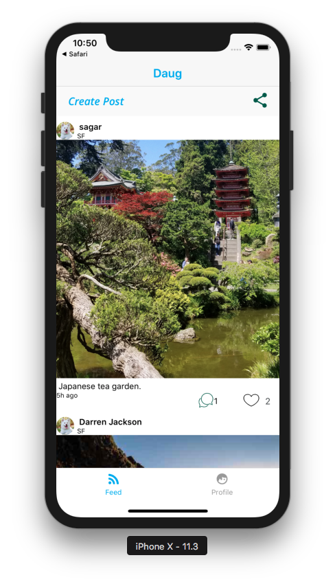
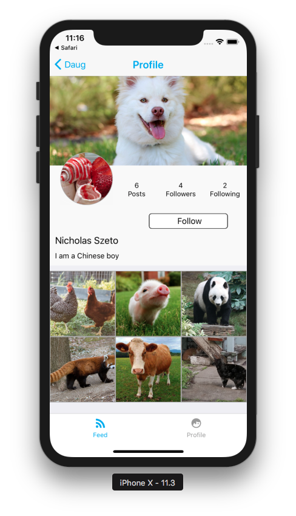
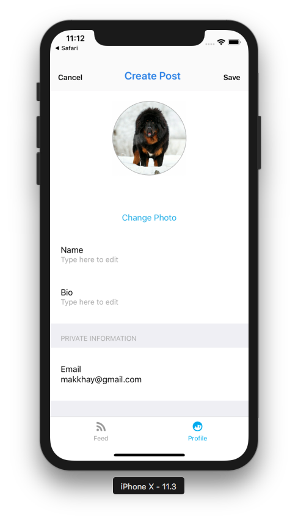

<p align="center">
  <a href="https://github.com/makkhay/daug-app">
    
  </a>
</p>

<h3 align="center">
  Daug mobile app
</h3>


### [Demo - Try it on Expo](https://expo.io/@makkhay/daug-app)

## What's Daug?

**Daug is a social network for pets.**

- Your pets can **sign up or login** using their paws.
- They can **upload selfies** or **post their thoughts** for other pets to see.
- They can also look at **other pets posts** and either **paw** (like) or **scratch** (dislike) it.


## Functionality
- Daug is a fully functioning Social Network app
- Users can Sign up & Log into the app
- Users can create new Posts
- Users can like and comments on Posts
- Users can follow each other
- Users can edit their profile


## Demo and Screenshots


<div style={{display: flex; flex-direction: row}}>
  
  
  
</div>

<div style={{display: flex; flex-direction: row}}>
  
  
  
</div>

<div style={{display: flex; flex-direction: row}}>
  
  
  
</div>


I have used React Native Camera library to let the users to post pictures. Also used React Native Elements library to build UI, React Navigation library to handle navigation, and packages such as react-native-modal and react-native-keyboard-aware-scroll-view to improve UI. 

Would like to implement a feature to see the list of followers and following. Also would like to add theme to the app to enable light/dark modes, and overall make the app more dynamic and functional.

## Designs

Profile screen is based on **Instagram**.

Social Feed screen is based on **Facebook** and **Instagram**.

## Milestones

Below you can see my main milestones and how I achieved them


## Milestone #1


### TODO

- [x] Design & build an Intro Screen
  - [ ] :star: **Bonus:** Add [Snap Carousel](https://github.com/archriss/react-native-snap-carousel) with [Lottie animations](https://docs.expo.io/versions/latest/sdk/lottie.html) to Intro Screen
- [x] Design & build an Signup Screen
- [x] Design & build an Login Screen
- [x] Design & build an Profile Screen
  - [x] :star: **Bonus:** Add the Logout button
- [x] Design & build an Social Feed Screen with [Mock Data](https://raw.githubusercontent.com/mobilespace/daug-mobile/c4d4a331564ee490e1162f3733f3023afe3defc3/app/utils/constants.js)
- [x] Attach screenshots/gif of screens to `README.MD`


## Milestone #2


### TODO

- [x] Understand the 3 main navigation patterns for mobile apps:
  - [x] [StackNavigator](https://reactnavigation.org/docs/hello-react-navigation.html#creating-a-stacknavigator)
  - [x] [TabNavigator](https://reactnavigation.org/docs/tab-based-navigation.html)
  - [] [DrawerNavigator](https://reactnavigation.org/docs/drawer-based-navigation.html)
- [x] Setup a **IntroStack** (using StackNavigator) for the Intro Screen (root), Login Screen (push) & Sign Up Screen (push)
- [x] Setup a **HomeTabs** (using TabNavigator) for the Social Feed Screen (default) and Profile Screen
- [x] Setup a **RootNavigator** (using StackNavigator) with the **IntroStack** & **HomeTabs** with `mode: "modal"`
- [x] Design & build an Edit Profile Screen
- [x] Setup a **ProfileStack** (using StackNavigator) for the Profile Screen (root), Post Details Screen (push) & Edit Profile Screen (modal) with mode: "modal" and custom RNE header component
- [x] Design & build a Post Details Screen
- [x] Design & build a Create Post Screen
- [x] Setup a **SocialStack** (using StackNavigator) for the Social Feed Screen (root), Post Details Screen (push) & Create Post Screen (modal) with mode: "modal" and custom RNE header component
- [x] :star: **Bonus:** Display Posts on ProfileScreen
- [x] :star: **Bonus:** Setup a **HomeNavigator**(using DrawerNavigator) with the **HomeTabs** (as root) and update **RootNavigator** to use **HomeNavigator** instead of **HomeTabs**
- [x] Add working gif of app to `README.MD`


## Milestone #3


### TODO

- [x] Intro Screen - Make simple **`GET`** request to **`/api`** to check server status
- [x] Signup Screen - Make **`POST`** request to **`/auth/signup`** to create a new user
	- [ ] :star: **Bonus:** Add UI validation to Signup Screen - name (not null), email (format) & password (min. 8 characters)
- [x] Login Screen - Make **`POST`** request to **`/auth/login`** to validate and login an existing user
	- [ ] :star: **Bonus:** Add UI validation to Login Screen - email (format) & password (min. 8 characters)
- [x] Social Feed Screen - Make **`GET`** request to **`/api/feed/`** to get all posts for social feed
	- [x] :star: **Bonus:** Use `ActivityIndicator` to show placeholder loading when fetching feed data
	- [x] :star: **Bonus:** Use `DeviceEventEmitter` to trigger fetching posts when the `new_post_created` event is emitted
	- [x] :star: **Bonus:** Use `timeSince()` utility function to show relative times for post creation
- [x] Create Post Screen - Make **`POST`** request to **`/api/users/:userId/posts`** to create a new post by the user
	- [x] :star: **Bonus:** Use `DeviceEventEmitter` to emit `new_post_created` event once post is created
- [x] Profile Screen - Make **`GET`** request to **`/api/users/:userId`** to get all the profile data
	- [x] :star: **Bonus:** Use `ActivityIndicator` to show placeholder loading when fetching profile data
	- [x] :star: **Bonus:** Use `DeviceEventEmitter` to trigger fetching profile data when the `user_profile_updated` event is emitted
- [x] Edit Profile Screen - Make **`PUT`** request to **`/api/users/:userId`** to update a user's profile information
	- [x] :star: **Bonus:** Use `DeviceEventEmitter` to emit `user_profile_updated` event once user data is updated
- [x] Setup Authentication flow for app using `AsyncStorage`. Once the user has logged in then take them to home page each time they open the app again
- [x] Add working gif of app to `README.MD`


## Wrap up

### TODO
- [x] Dynamically load user info 
- [x] Fix photo upload and add take photo functionality
- [x] Add Like, Comment and Follow API functionality
- [x] Clean up and format `README.MD` to showcase app - [follow this template](https://github.com/mobilespace/MobileGuides/blob/master/showcase_app_readme.md#readme-template-for-showcasing-a-mobile-app)
- [ ] :star: **Bonus:** Add phone number UI to Edit Profile screen
- [ ] :star: **Bonus:** Use Redux to share state between tab bar & screens
- [x] Add working gif of app to `README.MD`


## Getting started

```
git clone git@github.com:makkhay/daug-app.git

exp start

exp ios
```


## Feedback

In case you have any feedback or questions, feel free to open a new issues on this repo or reach out to me [**@makkhay**](https://github.com/makkhay) on Github. Thanks
